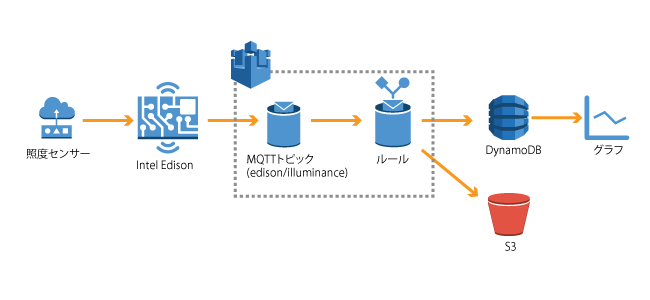

=======================
 1. イントロダクション
=======================

セクション1: IoTボタンを作ってみよう
-----------------------
Intel Edisonに接続されたボタンを押すと、Amazon SNSを通じて指定したメールアドレスにメールを送信します。

セクション2: センサーデータを送信してみよう
------------------------------
Intel Edisonに接続された照度センサーのデータをAWSの各サービスにストアします。
EdisonはAWS IoTのトピックにデータをパブリッシュし、AWS IoTでルールに基づきS3バケットへのアーカイブ、DynamoDBへのPutを行います。

