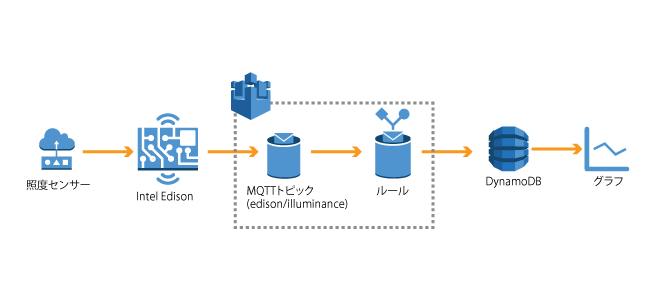

=======================
イントロダクション
=======================

ハンズオンシナリオ
==================

**シナリオ1: センサーデータの送信**

EdisonからAWS IoTのトピックに照度センサーのデータを送信し、AWS IoTでルールに基づきNoSQLデータベースDynamoDBへの保存を行います。また、しきい値を下回った場合、E-mailでアラートを送信するようにルールを設定します。本ハンズオンにより、センサーからのデータ取得および時系列データの保存、しきい値に対するアクションの手順を確認することができます。

|           

**シナリオ2: アプリケーションからLEDをリモート制御**

WebアプリケーションからEdisonに接続されたLEDの点灯/消灯の操作を行います。EdisonはAWS IoTのShadowのMQTTトピックをSubscribeしており、アプリケーションはShadowにコマンドを送信することでEdison側ではリアルタイムにコマンドを受信することができます。

.. image:: images/senario2.png

           

利用するデバイス、アプリケーション、サービス
============================================

**インテルEdison**

インテル社が提供する開発用のシングルボードコンピュータです。本ハンズオンではセンサーからのデータ取得、AWS IoTへのデータ送信に利用します。
    http://www.intel.co.jp/content/www/jp/ja/do-it-yourself/edison.html

|    

**Groveスターターキット**

Aruduinoなどの開発用ボードに接続可能なセンサーやケーブルが同梱されたキット。本ハンズオンではスターターキットの中のセンサーを選んでIntel Edisonに接続し、センサーデータを取得します。
    http://www.seeedstudio.com/document/Grove%20Starter%20Kit.pdf
    http://www.seeedstudio.com/wiki/GROVE_System

|    

**AWSアカウント**

AWSコマンドラインでiotおよびiot-dataを実行できるようにご利用のPCの設定をお願いします。
インストールの手順はこちらのとおりです。
    https://aws.amazon.com/jp/register-flow/

|    

**AWS IoT**

接続されたデバイスが安全かつ簡単にクラウドアプリケーションやその他のデバイスとやりとりするためのマネージド型プラットフォームです。本ハンズオンではデバイスからのデータ受信、デバイスのリモート制御などで利用します。
    https://aws.amazon.com/jp/iot/

|    

**Amazon DynamoDB**

マネージド型のNoSQLサービスで、高速で予測可能なパフォーマンスとシームレスな拡張性が特長です。本ハンズオンでは照度センサーで測定したデータを格納する時系列データベースとして利用します。

    https://aws.amazon.com/jp/dynamodb/

|    

**Amazon CloudWatch**

AWSクラウドリソースとAWSで実行するアプリケーションのモニタリングサービスです。メトリクスの収集、ログファイルの収集が可能です。本ハンズオンではCloudWatch Logsを利用してAWS IoTのログを収集、閲覧します。

    https://aws.amazon.com/jp/cloudwatch/

