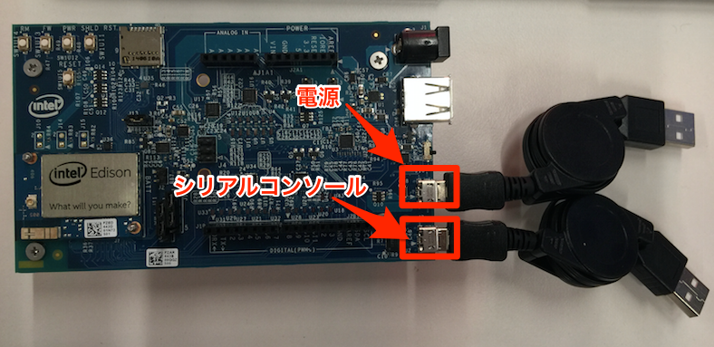

======================
インテルEdisonの設定
======================

インテルEdisonの準備を行います。

センサーの接続
==============

Grove Kitの中から照度センサーとボタン、LCDを取出し、以下のように接続します。また、USBケーブルを使ってご自分のPCとEdisonへ接続します。

=============== ====================
ポート          設定
=============== ====================
A0              照度センサー
D8              ボタン
I2C             LCDモニタ
=============== ====================

シリアルポート接続
==================

Edisonへ接続します。まず、Edisonにシリアルポート経由で接続します。USBケーブルでPCとEdisonを接続し、シリアルコンソールを開きます。

**Windowsの場合**

USBケーブルとACアダプタを図のように接続してください。

.. image:: images/usb-win.png

**MacOSの場合**

USBケーブル2本を図のように接続してください。

ターミナルソフトでEdisonに接続してください。接続に必要な情報はこちらです。**特にBaud Rateにご注意ください!**

========== =========================================================================
設定       設定項目
========== =========================================================================
Port       Edisonが接続されているUSBポート(Macであれば/dev/cu.usbserial-xxxx[FTDI])
Baud Rate  115200
Data Bits  8
Stop Bits  1
Parity     none
========== =========================================================================

Teratermをご利用の場合、メニューの[設定]-[シリアルポート]からスピードを"115200"に変更するのを忘れないでください。

MacOSをご利用の場合は、ターミナルから以下のコマンドを入力することで接続が可能です。

::
   
   $ sudo cu -s 115200 -l /dev/tty.usbserial-XXXXXXX
   Password: ←MacOSのrootパスワードを入力

プロンプトが表示されれば接続成功です。loginのプロンプトで、ユーザ名”root”、パスワード”Password1”でログインしてください。

::
   
   edison login: root
   Password: ******** ←パスワードを入力
   root@edison1: ~# 

WiFi設定
========

WiFiの設定を行います。ログイン後、**configure_edison --wifi** コマンドでSSIDとパスワードの設定を実施してください。

::
   
   root@edison1: ~# configure_edison --wifi

   Configre Edison: WiFi Connection

   Scanning: 8 seconds left..
   1. Exit WiFi setup
   2. Manually input a hidden SSID
   3. Guest
   4. xxxxxxxxx

   Enter 0 to rescan for networks.
   Enter 1 to exit.
   Enter 2 to input a hidden network SSID.
   Enter a number between 3 to N to choose one of the listed network SSIDs: ←Guestが表示されている番号を入力

   Is Guest corrrect? [Y or N]: ←Yを入力

   What is the network password?: ←WiFiのパスワードを入力
   Initiating connection to Guest. Please wait...
   Attempting to enable network access, please check 'wpa_cli status' after a minute to confirm.
   Done. Please connect your laptop or PC to the same network as this device and go to http://x.x.x.x or http://edison.local in your browser.
   (Doneが出力されたら成功）

