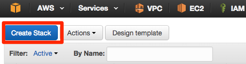
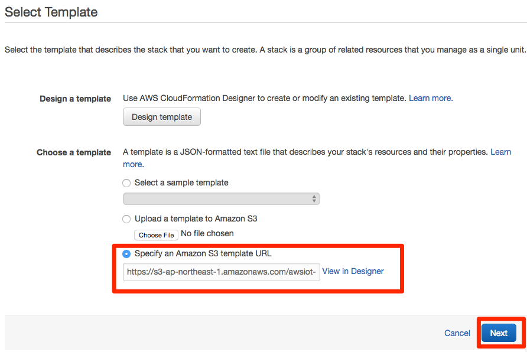
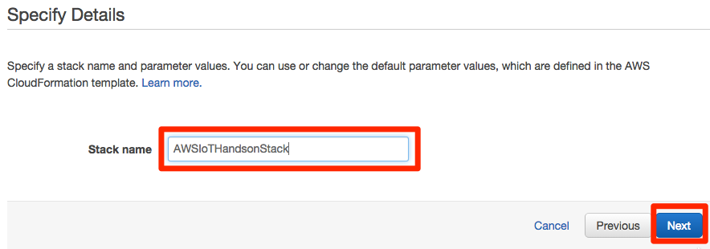
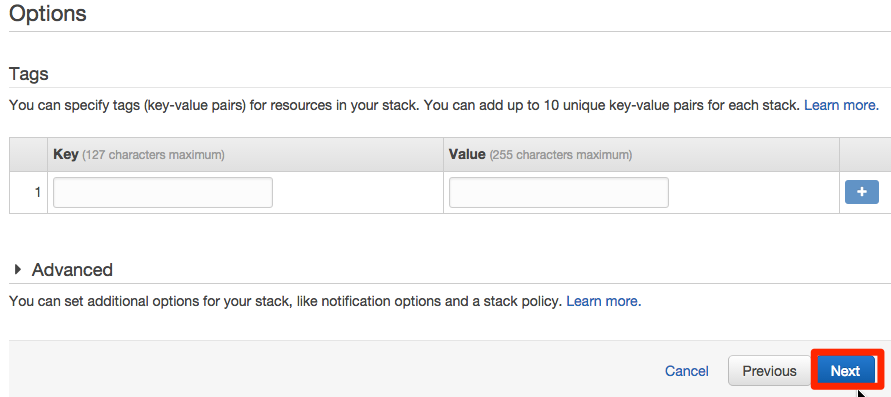
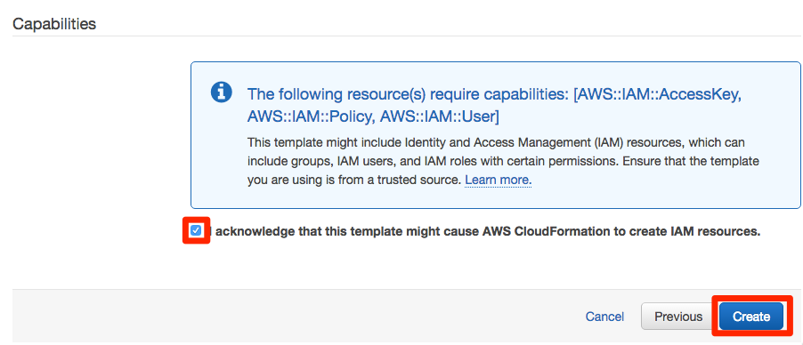
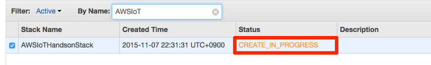
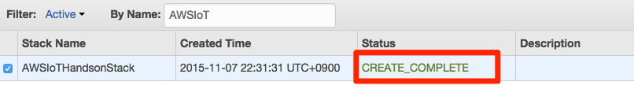
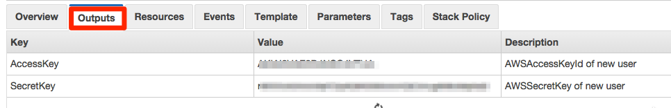

================
 ハンズオン準備
================

ハンズオンを始めるにあたり、事前の準備設定を行います。

ハンズオン用Cloud Formationのスタック作成
========================================

ハンズオンで利用するIAMユーザ、DynamoDBテーブルを作成を自動化するために、Cloud Formationのスタックを作成します。IAMユーザはedisonの証明書を作成するための権限を与えるために作成します。また、DynamoDBテーブルはシナリオ１のセンサーデータの保存用のテーブルとなります。

|

マネージメントコンソールのサービス一覧から"Cloud Formation"をクリックします。

|

"Choose a template"から"Specify an Amazon S3 template URL"にチェックを入れ、以下のパスを入力し、[Next]をクリックします。

https://s3-ap-northeast-1.amazonaws.com/awsiot-handson-jp/awsiothandson.template

|

"Stack Name"に"AWSIoTHandsonStack"と入力し、[Next]をクリックします。

|

"Options"で何も入力せずに[Next]をクリックします。

|

"Resource"の画面を下にスクロールし、"Capabilities"で"I acknowledge that this template..."にチェックを入れ、[Create]をクリックします。

|

Cloud Formationのスタックの一覧に作成したスタックが表示されるのを確認します。Statusは"CREATE_IN_PROGRESS"から"CREATE_COMPLETE"になるのを確認します。

|           

|

画面下の"Output"タブをクリックし、AccessKeyとSecretKeyが表示されていることを確認します。

|

Edison用サンプルコードの準備
============================

ハンズオンで利用するEdison用のサンプルコードのダウンロード、初期設定を行います。

