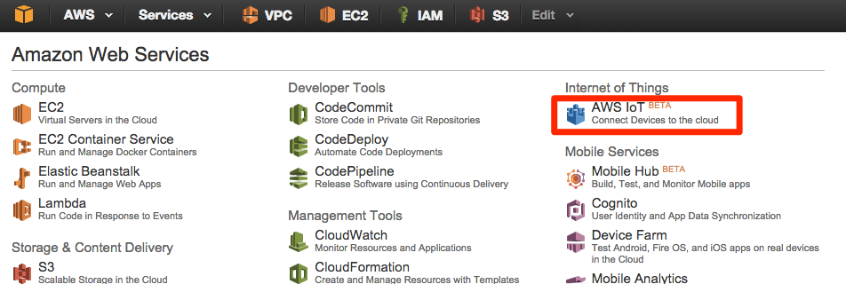
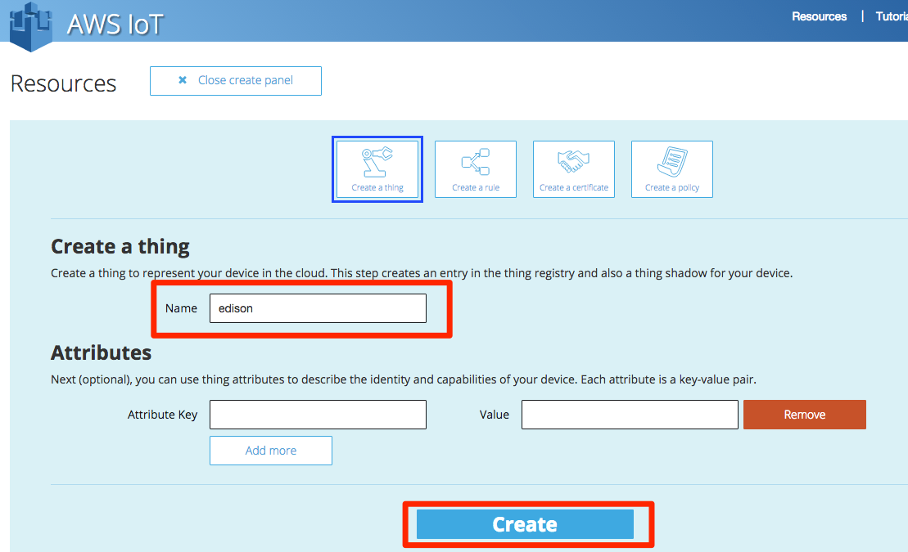
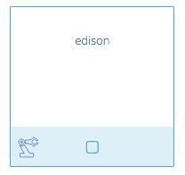
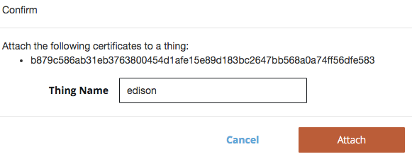

=================
 AWS IoT基本設定
=================

デバイスの作成
==============

AWSマネージメントコンソールへログインし、画面右上のメニューから東京リージョンを選択します。
サービス一覧から"AWS IoT"をクリックします。

|           
                   
“Get Startedが表示される場合はそちらをクリックします。

.. image:: images/3-getstart.png

|           

デバイス(Thing)を作成します。メニューの”Create a thing”をクリックします。Nameに”edison”と入力し、[Create]をクリックします。

|           

リソースの一覧で作成したデバイスが表示されます。

|           

証明書(Certificate)の作成
=========================

メニューの”Create a certificate”をクリックし、[1-Click Certificate Create]をクリックします。

.. image:: images/3-create-cert.png

|           

Download ~をクリックして、Public Key、Private Key、Certificateをそれぞれダウンロードします。

.. image:: images/3-download-cert.png

|           

画面下の作成した証明書をクリックし、画面右のActionsリストから[Activate]を選びます。

.. image:: images/3-activate-cert.png

|           
           
”ACTIVE”になったことを確認します 。

.. image:: images/3-activated-cert.png

|           

ポリシーの作成
==============

デバイスに対して、AWS IoTの各種操作を許可するためのポリシーを作成します。メニューの”Create a policy”をクリックします。フォームにそれぞれ以下のパラメータを入力し、[Create]をクリックします。

============= ============================
項目          値
============= ============================
Name          awsiot-handson-policy
Action        iot:*
Resource      * (アスタリスク)
============= ============================

|

.. image:: images/3-create-policy.png

|           

作成したポリシーがリソースの一覧に表示されます。

.. image:: images/3-policy.png

|           

先ほど作成した証明書をポリシーに割当てます。リスト中の証明書をクリックし、[Actions]-[Attach a policy]をクリックしてください。

.. image:: images/3-attach-policy.png

|           

“Confirm”の画面で、フォームにポリシー名”awsiot-handson-policy”を入力し、[Attach]をクリックします。

.. image:: images/3-attach-policy-2.png

|           

次に、デバイスと証明書の関連付けを行います。作成した証明書をリソース一覧の中から選択し、[Actions]-[Attach a thingクリックします。

.. image:: images/3-attach-thing.png

|           

"Thing Name"にデバイス名: edisonを入力し、[Attach]をクリックします。

