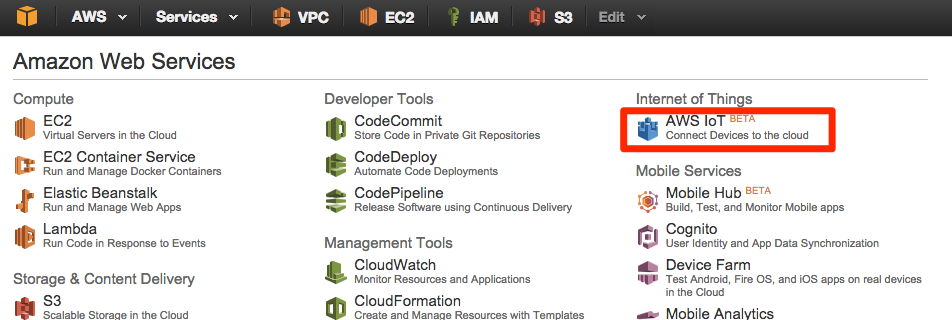
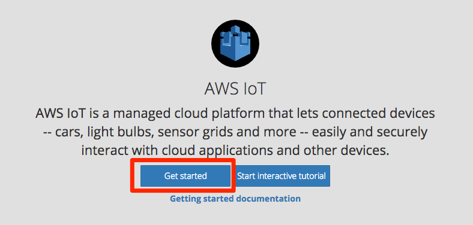
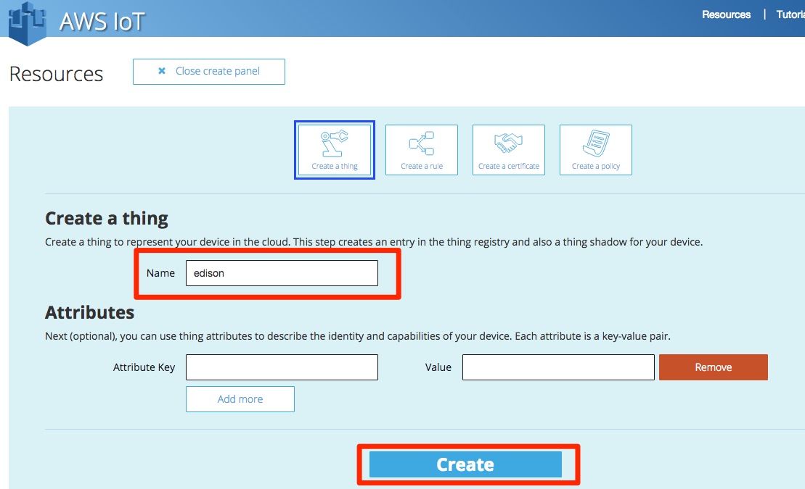
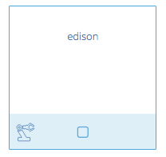
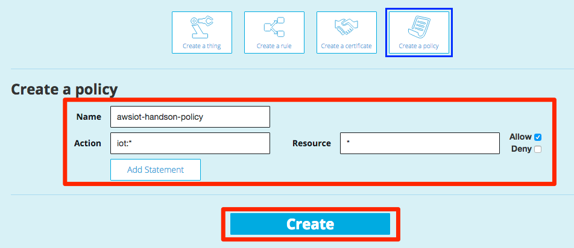
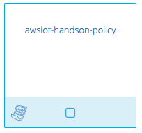
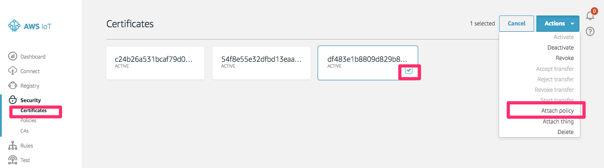
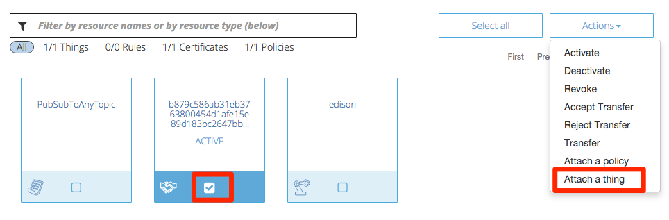
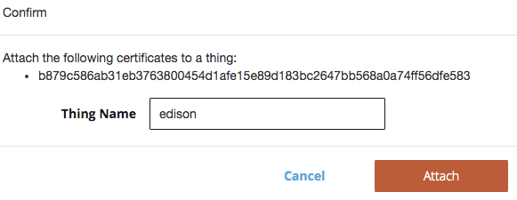

=================
AWS IoT基本設定
=================

デバイスの作成
==============

AWSマネージメントコンソールへログインし、画面右上のメニューから東京リージョンを選択します。
サービス一覧から"AWS IoT"をクリックします。

|           
                   
“Get Startedが表示される場合はそちらをクリックします。

|           

デバイス(Thing)を作成します。メニューの”Create a thing”をクリックします。Nameに”edison”と入力し、[Create]をクリックします。

|           

リソースの一覧で作成したデバイスが表示されます。

|           

ポリシーの作成
==============

デバイスに対して、AWS IoTの各種操作を許可するためのポリシーを作成します。メニューの”Create a policy”をクリックします。フォームにそれぞれ以下のパラメータを入力し、[Create]をクリックします。

============= ============================
項目          値
============= ============================
Name          awsiot-handson-policy
Action        iot:*
Resource      * (アスタリスク)
============= ============================

|

|           

作成したポリシーがリソースの一覧に表示されます。

|           

先ほど作成した証明書をポリシーに割当てます。リスト中の証明書をクリックし、[Actions]-[Attach a policy]をクリックしてください。(3章で証明書を作成したときのcertificateIdの証明書をリソースから選択してください。）

|           

“Confirm”の画面で、フォームにポリシー名”awsiot-handson-policy”を入力し、[Attach]をクリックします。

.. image:: images/4-attach-policy-2.png

|           

次に、デバイスと証明書の関連付けを行います。作成した証明書をリソース一覧の中から選択し、[Actions]-[Attach a thingクリックします。

|           

"Thing Name"にデバイス名: edisonを入力し、[Attach]をクリックします。

