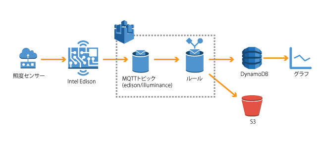

# -*- coding: utf-8 -*-
=====================
 AWSサービスとの連携
=====================

Intel Edisonに接続された照度センサーのデータをAWSの各サービスにストアします。
EdisonはAWS IoTのトピックにデータをパブリッシュし、AWS IoTでルールに基づきS3バケットへのアーカイブ、DynamoDBへのPutを行います。 

|

DynamoDBのテーブル作成
======================

センサーデータを保存するDynamoDBのテーブルを作成します。手順を簡略化するためにCloud Formationを利用します。テーブルのスキーマは以下のとおりです。

=========================== ===========================
設定項目                    値
=========================== ===========================
テーブル名                  awsiot-handson-rawdata
プライマリキータイプ        Hash and Range
ハッシュキー属性値          topic (String)
レンジキー属性値            timestamp (String)
=========================== ===========================

|

サービスメニューから"Cloud Formation"をクリックします。

[Create New Stack]をクリックします。

"Stack Name"にスタック名"awsiot-handson-stack"を入力します。

以下のURLを入力します。

..
    https://s3-ap-northeast-1.amazonaws.com/awsiot-handson-jp/dynamodb.template

AWS IoT ルールの作成
====================

プログラムの実行
================

