=================
 IoTボタンの作成
=================

Groveのボタンを利用してIoTボタンを作成します。ボタンを押すとAmazon SNSを通じて指定したメールアドレスにメールを送信するようにアクションを設定します。

ルールの作成
==============

edison/buttonトピックに到着したすべてのメッセージに対してアクションを設定します。

"Create a resource"をクリックし、"Create a rule"をクリックします。"Create a rule"の画面で以下の設定値を入力します。

============= ============================
項目          設定値
============= ============================
Name          SendEmail
Attribute     *(アスタリスク)
Topic Filter  edison/button
Condition     入力しない
============= ============================

|

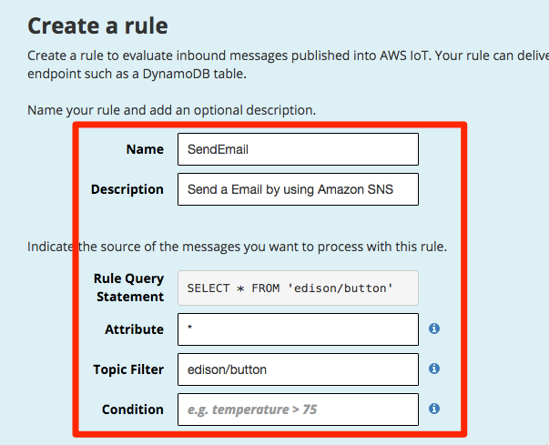

|   

"Choose an action"のリストから"Send message as a push notification (SNS)"を選択します。次に、SNSのトピックを作成するために[Create a new resource]をクリックします。別の画面にAmazon SNSの設定画面が表示されます。

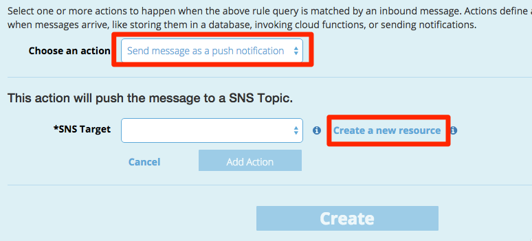

|           

[Create new Topic]をクリックします。

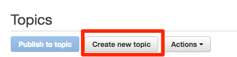

|

"Topic Name"と"Display Name"にそれぞれ"iotbutton"と入力し、[Create topic]をクリックします。

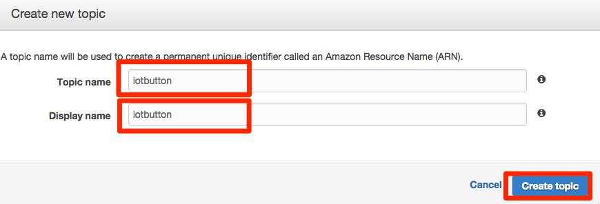

|
   
トピックの一覧から今回作成したiotbuttonのトピックを選択します。

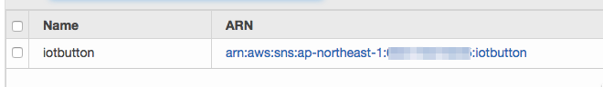

|   
           
[Create Subscription]をクリックします。

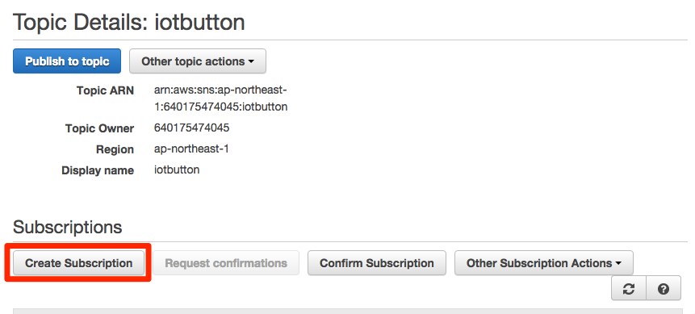

|           

"Protocol"のリストから"Email"を選択、"Endpoint"にすぐに受信が確認できるメールアドレスを入力し、[Create Subscription]をクリックしてください。

|           

先ほど入力したメールアドレスに確認メールが送信されます。"AWS Notification - Subscription Confirmation"というタイトルのメールを開き、本文中の"Confirm subscription"をクリックします。クリック後、"Subscription confirmed!"の画面が表示されます。

|

AWS IoTのルール作成画面に戻り、"SNS Target"からiotbuttonトピックを選択します。次に、[Create a new role]をクリックします。
           
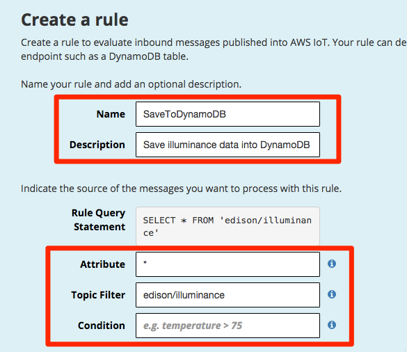

|           

IAMの設定画面が開きますので、[Allow]をクリックしてください。           
           
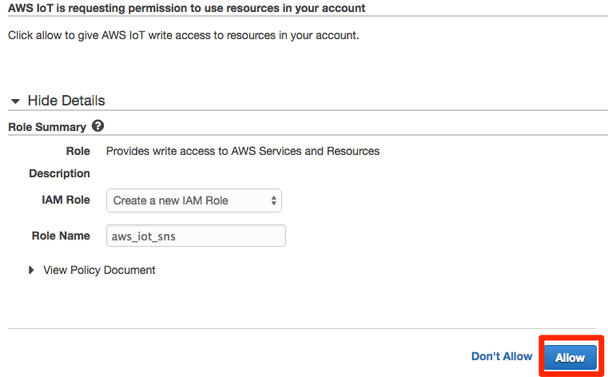

|           

AWS IoTのルール作成画面に戻り、[Add Action]をクリックします。

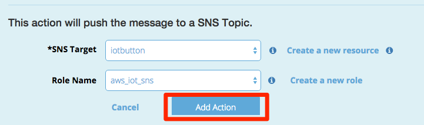

|           

SNS Actionが追加されたことを確認し、[Create]をクリックします。

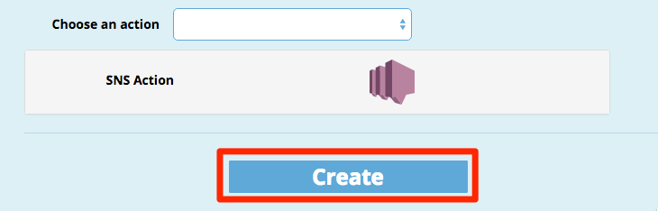

|           

リソースの一覧に作成したルールが表示されることを確認します。

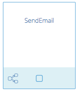

|           

プログラムの実行
================

