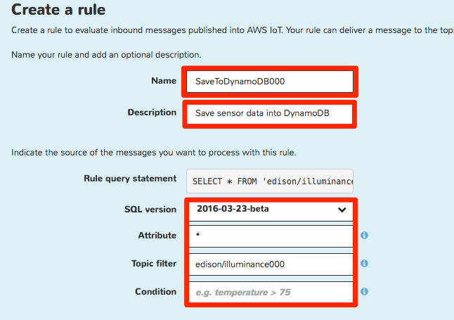
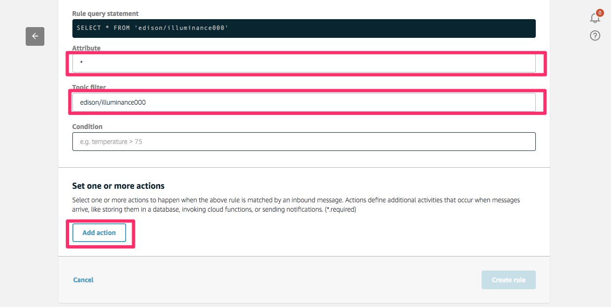
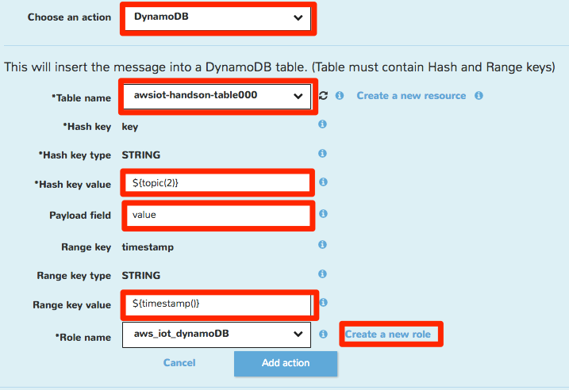
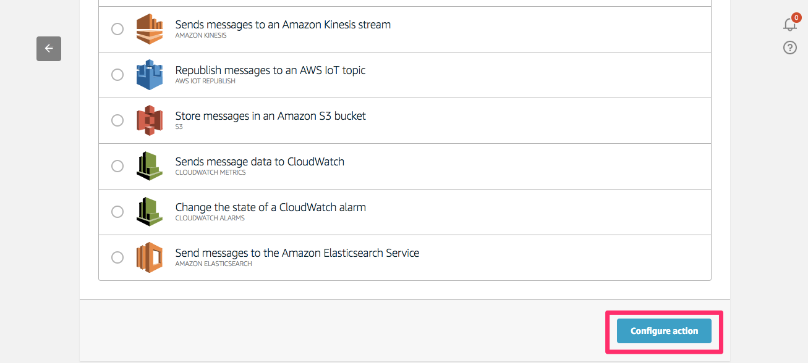
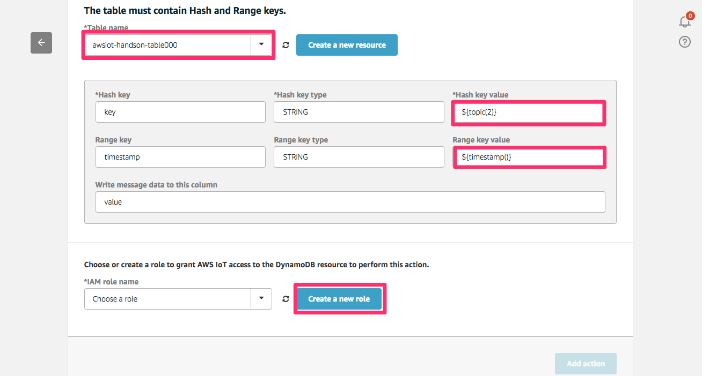
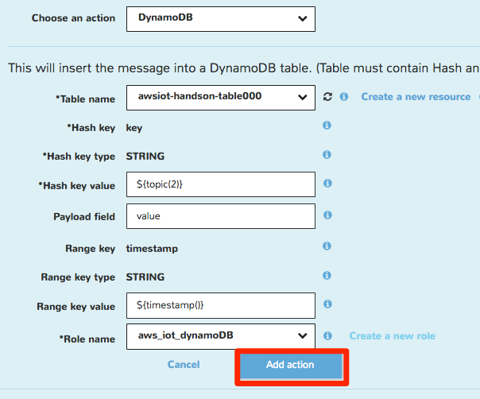
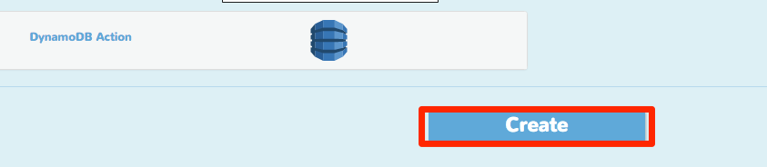
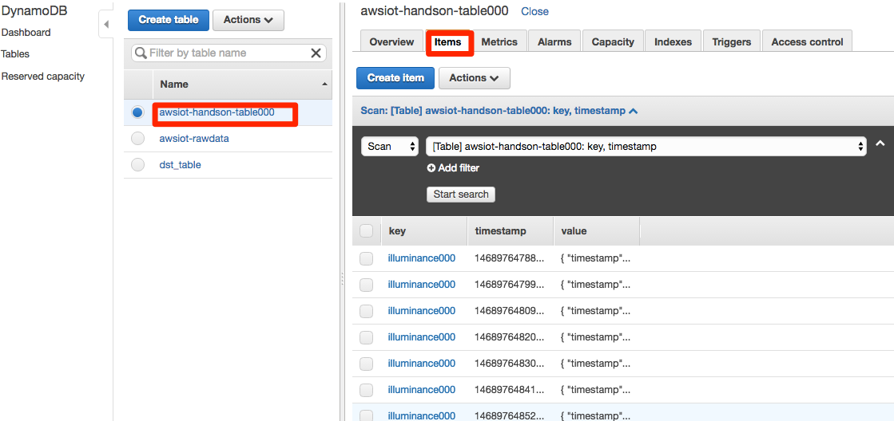

====================
センサーデータの送信
====================

Intel Edisonに接続された照度センサーのデータをAWSの各サービスにストアします。
EdisonはAWS IoTのトピックにデータをパブリッシュし、AWS IoTでルールに基づきDynamoDBへ保存します。使用するDynamoDBのテーブル"awsiot-handson-rawdata"は「3.ハンズオン準備」で作成したCloud Formationのスタックに含まれています。

.. image:: images/senario1.png

|

センサーデータは以下のJSONフォーマットとします。

::

  {
    "timestamp": "2015-10-24T14:16:37.305Z", ←ISO8601形式
    "value": "300"                           ←アナログ値
  }

|

AWS IoT ルールの作成
====================

メニューのRulesをクリックし[Create]をクリックします。

.. image:: images/5-create-rule-1.png

|           

スクリーンショットの赤枠で囲んだ部分について、以下の項目を入力します。
任意の番号の部分は他のユーザと被らない数字を入力してください。

=========================== ==============================
設定項目                      値
=========================== ==============================
Name                        SaveToDynamoDB<任意の番号>
SQL Version                 2016-03-23
Description                 任意
Attribute                   *(アスタリスク)
Topic Filter                edison/illuminance<任意の番号>
=========================== ==============================

|

|

[Add action]をクリックし、"Select an action"から"Insert a message into a Database table"を選択し、[Configure action]をクリックします。

|

以下の値を入力します。

=================================== ===========================
設定項目                                         値
=================================== ===========================
Table Name                          awsiot-handson-table<任意の番号>
Hash Key Value                      ${topic(2)}
Range Key Value                     ${timestamp()}
Write message data to this column   value
=================================== ===========================

|

|

AWS IoTからDynamoDBへデータをPutするためのRoleを作成します。
"Choose or create a role to grant AWS IoT access to the DynamoDB resource to perform this action."で[Create a new role]をクリックし、ロール名として"AWSIoTHandsonDynamoDB"と入力し、再度[Create a new role]をクリックします。
これによって入力したロール名が選択できるようになるので、作成したロールを選択し、[Upate role]をクリックし、次に[Add action]をクリックします。

.. image:: images/5-create-rule-5.png

|

"DynamoDB Action"が追加されたことを確認したら、[Create rule]をクリックします。

|

ルールが作成されたことを確認します。

プログラムの実行
================

照度センサーから照度データを取得し、AWS IoTのメッセージブローカーへ送信するためのプログラムを実行します。サンプルプログラム内のawsiot-handson-fundamentals配下のsensorに移動し、プログラムを実行します。

::

  root@edison:~awsiot-handson-fundamentals/sensor# node main.js  edison/illuminance<任意の番号>
  
  Publish: {"timestamp":"2015-10-24T14:16:37.305Z","value":268}
  Publish: {"timestamp":"2015-10-24T14:16:38.365Z","value":268}
  Publish: {"timestamp":"2015-10-24T14:16:39.424Z","value":271}
  Publish: {"timestamp":"2015-10-24T14:16:40.484Z","value":270}
  Publish: {"timestamp":"2015-10-24T14:16:41.535Z","value":272}

|  

DynamoDBのテーブルを確認し、データが格納されていることを確認してくださ
い。マネージメントコンソールのトップ画面に戻り、DynamoDBを選択します。
画面左のメニューの"Tables"をクリックし、テーブル一覧から
"awsiot-handson-table<任意の番号>"をクリックします。メイン画面上部の
"Item"タブをクリックし、テーブルのデータを表示します。

