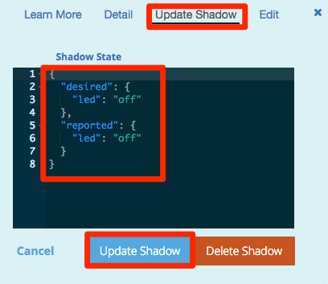

===================
 LEDのリモート制御
===================

AWS CLIを実行し、Intel Edisonに接続されたLEDのON/OFFを行います。AWS IoTのShadowを利用してブラウザからEdisonのステータスの変更リクエストを送信し、Edisonは変更通知を元にLEDをOFF/ONします。また、完了後は最新のステータスをShadowにアップデートします。

.. image:: images/senario2.png

プログラムの実行
================

Edison上で以下のプログラムを実行します。

.. code:: shell
  root@edison:~# cd awsiot-handson-fundamentals/led
  root@edison:~# awsiot-handson-fundamentals/led# node main.js

|          

マネージメントコンソールのAWS IoTを開き、リソースの一覧から"edison"を選択します。

右の詳細画面から"Update State"をクリックし、"State Detail"の画面に以下のJSONを入力してください。入力が終わったら"Update State"をクリックします。クリック後、EdisonのLEDが点灯することを確認してください。

::
   
   {
     "reported": {
       "led": "off"
     },
     "desired": {
       "led": "on"
     }
   }

|

|   

"desired"内にある"led"アイテムの値をoff/onのように記述を変更することでLEDの消灯/点灯を行なうことができます。

