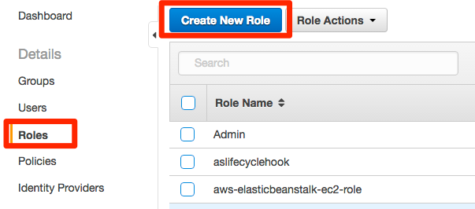

# -*- coding: utf-8 -*-
===================================
その他の設定
===================================

CloudWatch Logsの設定
=====================

AWS IoTのログはCloudWatch Logsで取得可能です。
詳細な手順はこちらに掲載されています。

http://docs.aws.amazon.com/iot/latest/developerguide/cloud-w

まず、メニュー画面から"Identity & Access Management"をクリックし、IAMの設定画面を表示します。画面左のメニューから"Roles"をクリックし、[Create New Role]をクリックします。

|

"Role Name"にロール名を入力し、[Next Step]をクリックします。

|

"Select Role Type"で"AWS IoT"の[Select]をクリックします。

.. image:: images/6-logs-3.png

|

"Attach Policy"で"AWSIoTLogging"のビルトインポリシーにチェックを入れ、[Next Step]をクリックします。

.. image:: images/6-logs-4.png

|

内容を確認します。次の手順のコマンドラインでARNが必要になるため、"Role ARN"の文字列をコピーしておきます。問題なければ[Create Role]をクリックしてください。

.. image:: images/6-logs-5.png

|

