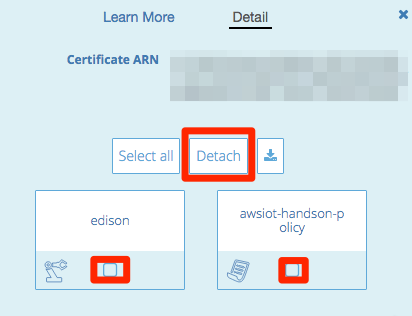
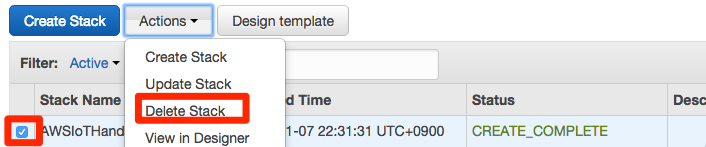

==================
 ハンズオン終了後
==================

ハンズオン終了後には以下の設定を削除してください。

AWS IoTのリソース削除
=====================

AWS IoTの証明書、ポリシー、デバイスを削除するためには、削除前にアタッチされているリソースをデタッチする必要があります。（ルールは他のリソースとの関連性はありません）

- マネージメントコンソールのサービスから[AWS IoT]を選択します。
- 削除したい証明書を選択します。
- 関連付けられているデバイスを選択し、[Detach]をクリックします。
- 同様にポリシーもデタッチします。

|

- 削除したいリソースを選択し、"Actions"のメニューから"Delete”を選択します。

|

CloudFormationスタックの削除
============================

- マネージメントコンソールのサービス一覧から[CloudFormation]をクリックします。
- リストから"AWSIoTHandsonStack"のスタックを選択し、"Actions"から[Delete Stack]をクリックします。

